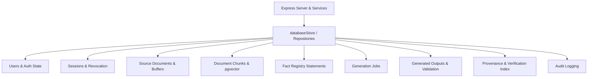

# ContentX Phase 2 Storage Dependency Map

## Overview
This document maps every data structure, read/write path, and consumer dependency within `src/server/store/databaseStore.ts` to prepare for the PostgreSQL 16 + pgvector migration.

---

## Data Structure Dependency Mapping

### 1. Users (`StoredUser`)
- **Current Storage**: `Map<string, StoredUser>` (Key: normalized lowercased email)
- **Fields**: `id`, `email`, `name`, `organization`, `role`, `created_at`, `password_hash`, `password_salt`
- **Read Operations**: `users.get(email)`, `users.has(email)`, `verifyPassword`
- **Write Operations**: `users.set(email, newUser)`, `seedUsersOnly()`
- **Consumers**: Auth routes (`/api/auth/login`, `/api/auth/register`), `verifySessionToken`, Admin bootstrap.
- **Target PostgreSQL Entity**: `users` table with unique constraint on `email` and check constraint on `role IN ('Admin', 'Editor', 'Viewer')`.

---

### 2. Sessions & Token Revocation
- **Current Storage**: `sessions: Map<string, User>`, `revokedTokens: Set<string>`
- **Fields**: Session token (base64url payload signed via SHA-256 HMAC), `expiresAt`, user object
- **Read Operations**: `verifySessionToken(token)`
- **Write Operations**: `createToken(user, rememberMe)`, `revokeToken(token)`
- **Consumers**: `attachUserMiddleware`, `requireAuth`, `/api/auth/logout`, `/api/auth/me`.
- **Target PostgreSQL Entity**: `sessions` table (token hash/id, user_id, expires_at, created_at) & `revoked_tokens` table.

---

### 3. Source Documents & File Buffers
- **Current Storage**: `documents: Map<string, SourceDocument>`, `documentBuffers: Map<string, Buffer>`
- **Fields**: `document_id`, `filename`, `mime_type`, `file_size`, `pages`, `word_count`, `upload_date`, `sha256_fingerprint`, `processing_status`, `detected_domain`, `raw_text`, `page_texts`, `security_scan`, `source_quality`, `understanding`, `rag_decision`, `facts_count`, `outputs_count`, `uploaded_by`, `is_demo`
- **Read Operations**: `documents.get(id)`, `documents.values()`
- **Write Operations**: `ingestDocument(params)`, `documents.delete(id)`
- **Consumers**: Document endpoints (`/api/documents`, `/api/documents/:id`, `/api/documents/upload`, `/api/documents/:id/reprocess`), RAG evaluation, Output generation.
- **Target PostgreSQL Entity**: `documents` table with JSONB for `security_scan`, `source_quality`, `understanding`, `rag_decision`.

---

### 4. Document Chunks & Vector Embeddings
- **Current Storage**: `documentChunks: Map<string, DocumentChunk[]>`, `chunkVectors: Map<string, Map<string, number[]>>`
- **Fields**: `chunk_id`, `document_id`, `chunk_index`, `page_number`, `start_word_index`, `end_word_index`, `word_count`, `source_text`, `embedding_model`, `embedding_dim`, `vector` (1024-dim BGE-M3 float array)
- **Read Operations**: `documentChunks.get(docId)`, vector retrieval (cosine similarity scan)
- **Write Operations**: `buildSlidingWindowChunks`, chunkVector insertion
- **Consumers**: RAG retrieval (`evaluateSelectiveRag`), Forensic document inspection, Grounded context builder.
- **Target PostgreSQL Entity**: `document_chunks` table with `embedding vector(1024)` column indexed via HNSW (`vector_cosine_ops`).

---

### 5. Fact Registry (`FactRegistryItem`)
- **Current Storage**: `facts: Map<string, FactRegistryItem[]>`, `factById: Map<string, FactRegistryItem>`
- **Fields**: `fact_id`, `document_id`, `source_chunk_id`, `source_page`, `category`, `importance`, `certainty`, `negated`, `statement`, `entities`, `dates`, `numbers`, `technical_identifiers`, `domain_specific`
- **Read Operations**: `facts.get(docId)`, `factById.get(factId)`, `/api/facts`, `/api/facts/:fact_id`
- **Write Operations**: `buildUnderstandingAndFactRegistry` -> `facts.set(docId, facts)`
- **Consumers**: Format generation (`compileGroundedFormatFromRegistry`), Output validation (`validateGeneratedOutput`), Claim traceability, Forensic inspection.
- **Target PostgreSQL Entity**: `facts` table with JSONB for `entities`, `dates`, `numbers`, `technical_identifiers`, `domain_specific`.

---

### 6. Generation Jobs & Generated Outputs
- **Current Storage**: `jobs: Map<string, GenerationJob>`, `outputs: Map<string, GeneratedOutputRecord>`
- **Fields**:
  - Job: `job_id`, `document_id`, `document_name`, `domain`, `audience`, `selected_formats`, `execution_mode`, `status`, `completed_formats`, `failed_formats`, `output_ids`, `created_at`
  - Output: `output_id`, `job_id`, `document_id`, `format`, `status`, `content` (JSON), `claims` (Array), `fact_ids_used` (Array), `validation` (15-point check result), `verification_id`, `created_at`
- **Read Operations**: `jobs.get(id)`, `outputs.get(id)`, `/api/outputs`, `/api/history`
- **Write Operations**: `executeTransformationJob` -> `jobs.set()`, `outputs.set()`
- **Consumers**: Output studio view, Claim inspector drawer, History view, Analytics, Verification lookup.
- **Target PostgreSQL Entity**: `generation_jobs` table & `generated_outputs` table with JSONB for `content`, `claims`, `validation`.

---

### 7. Provenance & Public Verification Index
- **Current Storage**: `provenanceRecords: Map<string, ProvenanceRecord>`, `verificationIndex: Map<string, string>` (verification_id -> provenance_id)
- **Fields**: `provenance_id`, `verification_id`, `document_id`, `document_name`, `output_id`, `format`, `sha256_output_hash`, `sha256_source_hash`, `fact_ids_used`, `validation_score`, `model_name`, `approval_status`, `created_at`
- **Read Operations**: `verifyByVerificationId(verificationId, tamperedContent)`, `/api/provenance`, `/api/verification/:id`
- **Write Operations**: `executeTransformationJob` -> `provenanceRecords.set()`, `verificationIndex.set()`
- **Consumers**: Public verification portal (`/verify/:id`), Provenance ledger view.
- **Target PostgreSQL Entity**: `provenance_records` table with UNIQUE constraint on `verification_id`.

---

### 8. Audit Logs
- **Current Storage**: `auditLogs: AuditLogEntry[]`
- **Fields**: `log_id`, `timestamp`, `user_email`, `user_role`, `action`, `resource_id`, `details`
- **Read Operations**: `/api/history` (`dbStore.auditLogs.slice(0, 50)`)
- **Write Operations**: `logAudit(userEmail, userRole, action, resourceId, details)`
- **Consumers**: Compliance history, RBAC security audit tracking.
- **Target PostgreSQL Entity**: `audit_logs` table indexed by `created_at` DESC.

---

## Persistence Architecture Strategy

To replace volatile memory with zero runtime regression:
1. Create a **PostgreSQL Client** ([postgresClient.ts](file:///c:/Users/HP/Desktop/ContentX%20Hackathon/ContentX_Hackathon/src/server/store/postgres/postgresClient.ts)) using the official `pg` driver with connection pooling.
2. Define SQL Schema & Migrations ([001_initial_schema.sql](file:///c:/Users/HP/Desktop/ContentX%20Hackathon/ContentX_Hackathon/src/server/store/postgres/migrations/001_initial_schema.sql)) including `CREATE EXTENSION IF NOT EXISTS vector;` and `vector(1024)` HNSW indexing.
3. Build Modular Repositories in `src/server/store/repositories/`:
   - `userRepository.ts`
   - `sessionRepository.ts`
   - `documentRepository.ts`
   - `chunkRepository.ts`
   - `factRepository.ts`
   - `generationRepository.ts`
   - `outputRepository.ts`
   - `provenanceRepository.ts`
   - `auditRepository.ts`
4. Maintain `ContentXStore` facade interface so all application services and Express controllers call identical method signatures seamlessly.
5. Provide `CONTENTX_STORAGE_MODE=postgres` (production default) and `CONTENTX_STORAGE_MODE=memory` (unit test option). In production, PostgreSQL is strictly required and readiness fails if unreachable.
